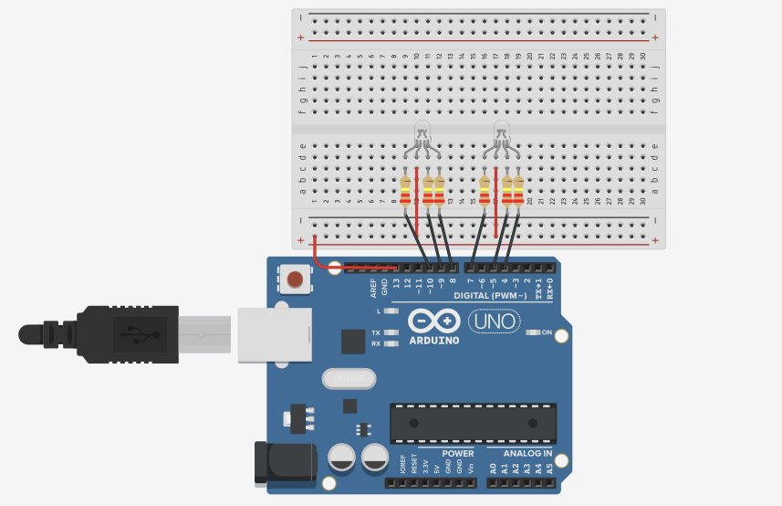
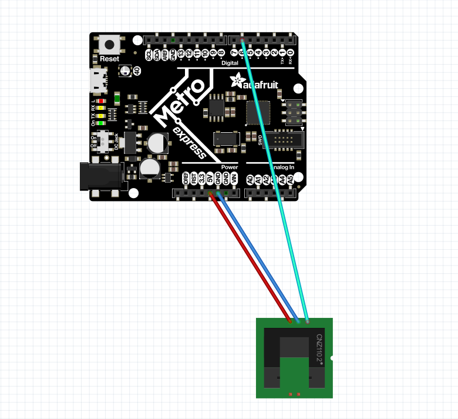

# ExpertCircuitPython
Expert CircuitPython Coursework Engineering III

## Table of Contents
* [Classes, Objects, and Modules](#ClassesObjectsModules)
* [Fun with RGB LED's](#RGBleds)
* [Photointerrupters](#Photointerrupter)

## ClassesObjectsModules

### Description & Code
This assignment introduced the concept of classes, objects, and modules, as the name suggests. The point of *modules* is to simplify code, so that a function can easily be performed using a more simple code. They can be called in other pieces of code, like pwmio, to easily set up and more easily use PWM pins. Modules can set up *classes*, which set the parameters of a fucntion that can be used. For example, the pwmio module uses the class "PWMOut" to set up a pwm pin going out. Classes are used to create objects which inherit all of the properties of the class.

```python
# this is the module for the led code
import time
import board
import pwmio

class LED:      
    '''LED is used to make a single led fade from on to off'''
    
    def __init__(self, ledpin):  # set up the reference point (here, the pin) ledpin
       self.led = pwmio.PWMOut(ledpin, frequency=5000, duty_cycle=0)
       # declare variable led, more or less - it is set up the way it would be in normal code

    def fade(self):
    '''this is the same code you would use in running a single fading led, but have to tell it to refer to "self" - this makes it applicable to any object it is applied to'''
        for i in range(100):
            if i < 50:  
                self.led.duty_cycle = int(i * 2 * 65535 / 100)  # Up
            else:
                self.led.duty_cycle = 65535 - int((i - 50) * 2 * 65535 / 100)  # Down
            print(self.led.duty_cycle)
            time.sleep(0.03)
```
```python
# this is the led code
import time
import board
from led import LED  # import the LED class from module, which is named led

blueLEDPin = board.D9  # set up variable for the pin used

myBlueLED = LED(blueLEDPin)  # set up variable using the class LED, define "blueLEDpin" as reference point "ledpin"

while True:
    myBlueLED.fade()  # tell variable which represents the use of the class to do the function "fade" defined in the class
```


### Evidence


### Wiring


### Reflection
This assignment took a little bit of time to figure out, because understanding the code jargon takes a couple minutes. However, once you realise a class is just how you call the function you're trying to set up in the main code, and the module is just the whole code where your classes are, deciphering the rest is a little easier. As for the code itself, it's important to remember that when refering to the object that you want to be changing (in this case, the variable that would be led), has to be the variable established in the initialising section (--init--), self.led in this case. Also, it took me a couple minutes to realise the module had to be added to the Metro's library. Overall, this assignment was a little confusing, but generally manageable.

[Back to Table of Contents](#Table_of_Contents)


## RGBleds

### Description & Code
This assignment was to use RGB LEDs, which are basically just more complicated, more colorful LEDs, using modules. Since RGB LEDs use three pins, one for each of their "primary" colors (which are red, blue, and green), colors can be defined by changing the brightness (ie, changing the voltage) of each pin, thus changing the color. The class RGB sets up the three pins, and then defines methods for different colors, changing the brightness of each to create a specific color.

```python
''' This file is the class-based version of making a single LED fade - Mr. H's assignment code'''
import time
import board
from rgb import RGB

redLEDPin1 = board.D10
greenLEDPin1 = board.D9
blueLEDPin1 = board.D8

redLEDPin2 = board.D7
greenLEDPin2 = board.D5
blueLEDPin2 = board.D4  #D6 is using the same timer as D8,9,10.  Avoid!

full = 65535
half = (65535/5)

myRGBled1 = RGB(redLEDPin1, greenLEDPin1, blueLEDPin1)
myRGBled2 = RGB(redLEDPin2, greenLEDPin2, blueLEDPin2)


while True:
''' This file is the class-based version of making a single LED fade'''
import time
import board
from rgb import RGB

redLEDPin1 = board.D10
greenLEDPin1 = board.D9
blueLEDPin1 = board.D8

redLEDPin2 = board.D7
greenLEDPin2 = board.D5
blueLEDPin2 = board.D4  #D6 is using the same timer as D8,9,10.  Avoid!

full = int(65535)
half = int(65535/2)

myRGBled1 = RGB(redLEDPin1, greenLEDPin1, blueLEDPin1)
myRGBled2 = RGB(redLEDPin2, greenLEDPin2, blueLEDPin2)


while True:
    myRGBled1.blue()
    myRGBled2.yellow()
    time.sleep(1)
    myRGBled1.blue(half)
    myRGBled2.yellow(half)
    time.sleep(1)
    myRGBled1.off()
    myRGBled2.off()
    time.sleep(1)

    myRGBled1.red()
    myRGBled2.cyan()
    time.sleep(1)
    myRGBled1.off()
    myRGBled2.off()
    time.sleep(1)

    myRGBled1.green(half)
    myRGBled2.magenta(half)
    time.sleep(1)
    myRGBled1.off()
    myRGBled2.off()
    time.sleep(1)

    myRGBled1.white(half)
    myRGBled2.white(half)
    time.sleep(.25)
    myRGBled1.white()
    myRGBled2.white()
    time.sleep(.25)
    myRGBled1.white(half)
    myRGBled2.white(half)
    time.sleep(.25)
    myRGBled1.white()
    myRGBled2.white()
    time.sleep(.25)
    myRGBled1.white(half)
    myRGBled2.white(half)
    time.sleep(.25)
    myRGBled1.white()
    myRGBled2.white()
    time.sleep(.25)
    myRGBled1.white(half)
    myRGBled2.white(half)
    time.sleep(.25)
    myRGBled1.white()
    myRGBled2.white()
    time.sleep(.25)
    myRGBled1.off()
    myRGBled2.off()
    time.sleep(5)

# extra spicy (optional) part
# you should replace "rate1" with a real number...
    myRGBled1.rainbow(2) # Fade through the colors of the rainbow at the given rate.  Oooooh, pretty!
    myRGBled2.rainbow(.5) # Fade through the colors of the rainbow at the given rate.  Oooooh, pretty!
    time.sleep(5)
```

``` python
# These are the libraries needed to fade an LED, even if you imported elsewhere
import time
import board
import pwmio
import digitalio

lightBulb = digitalio.DigitalInOut(board.D13)       # I moved my RGBLED power wire from 5v
lightBulb.direction = digitalio.Direction.OUTPUT    # and plugged it into D13.  I'll explain later.

class LED:      # It's propper coding to always write a line explaining a class
                # with a "docstring."   Like this:
    '''LED is a class designed for a single color LED to fade in and out'''

    def __init__(self, ledpin, name):
        # init is like void Setup() from arduino.  Initialize your pins here
        self.led = pwmio.PWMOut(ledpin, frequency=5000, duty_cycle=0)
        self.name = name

    def fadedown(self): # Fades LED from bright to dim
        for i in range(255):
            if i < (255/2):
                self.led.duty_cycle = int(i * 65535 / (255/2))
            print(self.name, ", ", self.led.duty_cycle)
            time.sleep(0.01)

    def fadeup(self):  # Fades LED from dim to bright
        for i in range(255):
            if i > (255/2):
                self.led.duty_cycle = 65535 - int((i - (255/2)) * 65535 / (255/2))
            print(self.name, ", ", self.led.duty_cycle)
            time.sleep(0.01)

    def on(self, brightness=65535):  # Remember "on" means duty cycles < 65535
        self.led.duty_cycle = 65535 - brightness  # these are reversed!!! 
        # rgb leds pull current the opposite way as you would expect
        lightBulb.value = 65535


    def off(self): # "off" means duty cycle should be full.
        self.led.duty_cycle = 65535


class RGB:
    '''this class should impliment all 3 pins together to control an RGB LED - up until here is Mr. H's'''
    from rgb import LED  # use methods set up in led, like on, off

    def __init__(self, redPin, greenPin, bluePin):
        self.myRedLED = LED(redPin, "red")  # initialise ledpins using class LED
        self.myBlueLED = LED(bluePin, "blue")
        self.myGreenLED = LED(greenPin, "green")

    def blue(self, brightness=65535):
        # Notice the brightness=65535?  Thats an OPTIONAL parameter!  So in main.py,
        # you can call "RGBLED1.blue() for full brightness, or "RGBLED1.blue(half) to
        # make it dimmer!
        self.myBlueLED.on(brightness)  # using brightness, otherwise it won't change
        self.myGreenLED.off()
        self.myRedLED.off()

    def yellow(self, brightness=65535):
        self.myBlueLED.off()
        self.myGreenLED.on(brightness)  # yes, yellow is green and red. gross
        self.myRedLED.on(brightness)

    def red(self, brightness=65535):
        self.myBlueLED.off()
        self.myGreenLED.off()
        self.myRedLED.on(brightness)

    def cyan(self, brightness=65535):
        self.myBlueLED.on(brightness)  # color theory
        self.myGreenLED.on(brightness)
        self.myRedLED.off()

    def green(self, brightness=65535):
        self.myBlueLED.off()
        self.myGreenLED.on(brightness)
        self.myRedLED.off()

    def magenta(self, brightness=65535):
        self.myBlueLED.on(brightness)
        self.myGreenLED.off()
        self.myRedLED.on(brightness)

    def white(self, brightness=65535):
        self.myBlueLED.on(brightness)
        self.myGreenLED.on(brightness)
        self.myRedLED.on(brightness)
    
    def rainbow(self, rate):
        self.myBlueLED.off()  # red
        self.myGreenLED.off()
        self.myRedLED.on()
        time.sleep(rate)  # time sleep value equal to the rate defined in main
        self.myBlueLED.off()  # yellow
        self.myGreenLED.on()
        self.myRedLED.on()
        time.sleep(rate)
        self.myBlueLED.off()  # green
        self.myGreenLED.on()
        self.myRedLED.off()
        time.sleep(rate)
        self.myBlueLED.on()
        self.myGreenLED.on()  # cyan
        self.myRedLED.off()
        time.sleep(rate)
        self.myBlueLED.on()  # blue
        self.myGreenLED.off()
        self.myRedLED.off()
        time.sleep(rate)
        self.myBlueLED.on()  # magenta
        self.myGreenLED.off()
        self.myRedLED.on()
        time.sleep(rate)
        self.myBlueLED.on()  # white
        self.myGreenLED.on()
        self.myRedLED.on()
        time.sleep(rate)


    def off(self):
        self.myBlueLED.off()
        self.myGreenLED.off()
        self.myRedLED.off()
        lightBulb.value = 0
```

### Evidence


### Wiring


### Reflection
This assignment expanded the use of modules and classes, by making use of a module to set up a color changing led. This is useful, because you can control two LEDs at the same time with the same code. The primary lesson I learned was check your resistors, especially with the RGB LEDs, as both refused to work correctly over a partially unplugged resistor. This assignment was also a valuable lesson in light color theory, because green and red are yellow with the RGB LEDs. 

[Back to Table of Contents](#Table_of_Contents)


## Photointerrupter

### Description & Code
Use photoresistor to print interrupts to the serial monitor. This assignment introduced a bunch of new functions, including the digitalio library, string function, and various variables. I used [this site](https://github.com/gventre04/CircuitPython) for guidance, and modified it to fit the assignment.

```python
# photointerrupter, L.G. 24.09.21

import time
import digitalio
import board

initial = time.monotonic()  #set initial time

resistorPin = digitalio.DigitalInOut(board.D7) 
resistorPin.direction = digitalio.Direction.INPUT
resistorPin.pull = digitalio.Pull.UP
# define resistor pin for photointerruptor - uses board as resistor

counter = 0  # counts # of times photointerruptor interrupted

val = False  # store value of resistorPin
state = False  # store state (LOW/HIGH) of resistorPin

while True:
    val = resistorPin.value
    if val and not state:
        counter += 1  # add one to counter when state change detected
    state = val

    now = time.monotonic()  # sets current time
    if now - initial >= 4:
        print("I have been interrupted", str(counter), "times")
        initial = now  # resets initial to current (counting to 4 again)
    time.sleep(0.1)
```

### Evidence


### Wiring


### Reflection
Using the digitalio library to use the pin connection as a resistor in order to detect a change in the state of the pin connecting it to the photointerrupter, this code is used to tell when a photointerrupter is interupted and count how many times this happens. By using the digitalio library, the pin is held at logic voltage, a high state, and switches to a low state when the photointerrupter is intrrupted. The counter is printed to the serial monitor every 4 seconds using time.monotonic(), a function which is used to calculate time based on a starting point, rather than the general time function which does not measure the time passed. By using two different time.monotonic() functions, one for the initial time and one for the current time, the time that had passed was able to be calculated and the count reset when it reached 4 in order to count back up to four again. 

[Back to Table of Contents](#Table_of_Contents)
