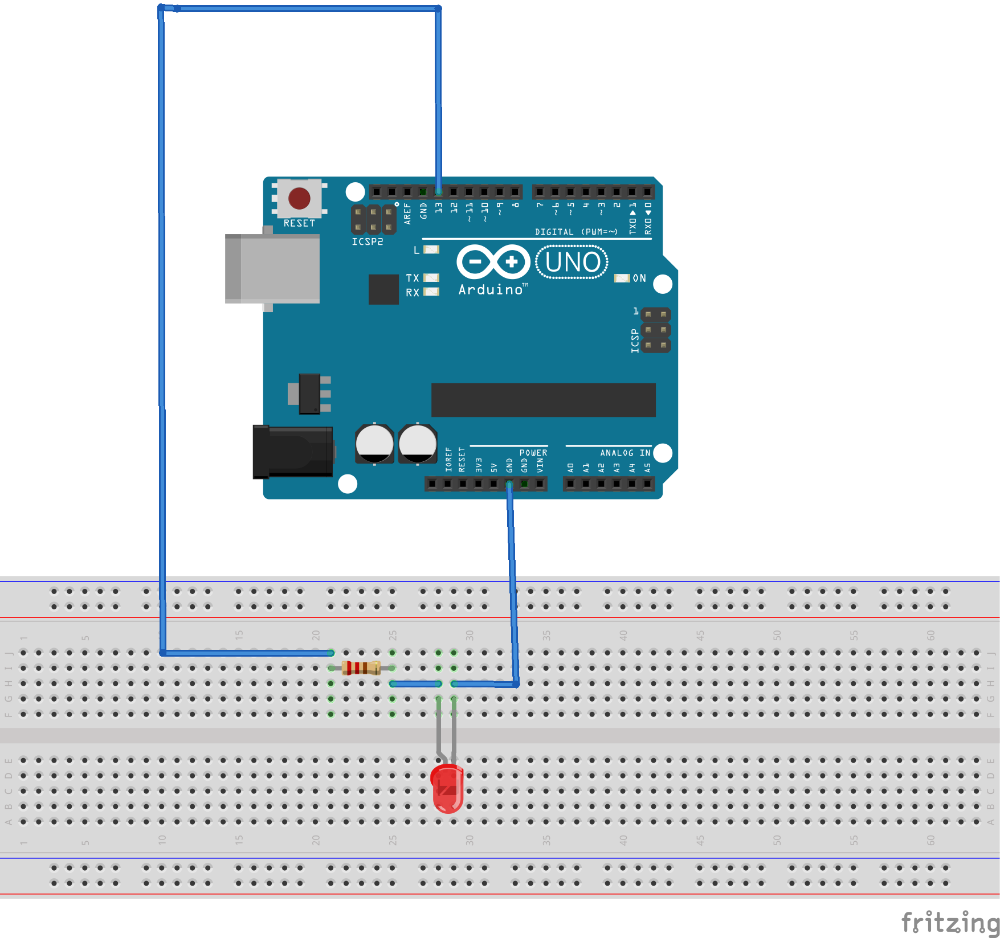

# ExpertCircuitPython
Expert CircuitPython Coursework Engineering III

## Table of Contents
* [Classes, Objects, and Modules](#ClassesObjectsModules)

## ClassesObjectsModules

### Description & Code
This assignment introduced the concept of classes, objects, and modules, as the name suggests. The point of *modules* is to simplify code, so that a function can easily be performed using a more simple code. They can be called in other pieces of code, like pwmio, to easily set up and more easily use PWM pins. Modules can set up *classes*, which set the parameters of a fucntion that can be used. For example, the pwmio module uses the class "PWMOut" to set up a pwm pin going out. Classes are used to create objects which inherit all of the properties of the class.

```python
# this is the module for the led code
import time
import board
import pwmio

class LED:      
    '''LED is used to make a single led fade from on to off'''
    
    def __init__(self, ledpin):  # set up the reference point (here, the pin) ledpin
       self.led = pwmio.PWMOut(ledpin, frequency=5000, duty_cycle=0)
       # declare variable led, more or less - it is set up the way it would be in normal code

    def fade(self):
    '''this is the same code you would use in running a single fading led, but have to tell it to refer to "self" - this makes it applicable to any object it is applied to'''
        for i in range(100):
            if i < 50:  
                self.led.duty_cycle = int(i * 2 * 65535 / 100)  # Up
            else:
                self.led.duty_cycle = 65535 - int((i - 50) * 2 * 65535 / 100)  # Down
            print(self.led.duty_cycle)
            time.sleep(0.03)
```
```python
# this is the led code
import time
import board
from led import LED  # import the LED class from module, which is named led

blueLEDPin = board.D9  # set up variable for the pin used

myBlueLED = LED(blueLEDPin)  # set up variable using the class LED, define "blueLEDpin" as reference point "ledpin"

while True:
    myBlueLED.fade()  # tell variable which represents the use of the class to do the function "fade" defined in the class
```


### Evidence


### Wiring


### Reflection
This assignment took a little bit of time to figure out, because understanding the code jargon takes a couple minutes. However, once you realise a class is just how you call the function you're trying to set up in the main code, and the module is just the whole code where your classes are, deciphering the rest is a little easier. As for the code itself, it's important to remember that when refering to the object that you want to be changing (in this case, the variable that would be led), has to be the variable established in the initialising section (--init--), self.led in this case. Also, it took me a couple minutes to realise the module had to be added to the Metro's library. Overall, this assignment was a little confusing, but generally manageable.

[Back to Table of Contents](#Table_of_Contents)
